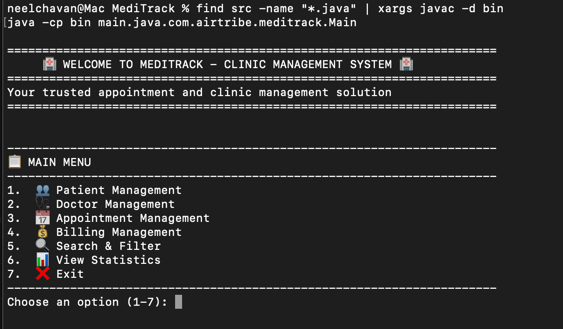

# Setup Instructions - MediTrack

## Prerequisites

### Java Development Kit (JDK)
- **Required Version:** JDK 11 or higher
- **Download:** [Oracle JDK](https://www.oracle.com/java/technologies/downloads/) or use OpenJDK
- **Verification:**
  ```bash
  java -version
  javac -version
  ```

### IDE Setup

#### IntelliJ IDEA
1. Open MediTrack project folder
2. Configure JDK: Preferences → Project Structure → Project → JDK
3. Mark `src/main/java` as Sources Root
4. Build → Build Project

### Manual Compilation
```bash
cd /Users/neelchavan/vscode/MediTrack
javac -d bin src/main/java/com/airtribe/meditrack/**/*.java
```

## Running MediTrack

### Basic Execution
```bash
cd /Users/neelchavan/vscode/MediTrack
find src -name "*.java" | xargs javac -d bin
java -cp bin main.java.com.airtribe.meditrack.Main
```


## Project Structure
```
MediTrack/
├── src/main/java/com/airtribe/meditrack/
│   ├── Main.java
│   ├── entity/
│   ├── service/
│   ├── util/
│   ├── exception/
│   ├── interfaces/
│   └── test/
├── docs/
└── data/ (CSV files)
```

## Verification Checklist
- [ ] JDK installed and accessible
- [ ] Project compiles without errors
- [ ] Main.java runs successfully
- [ ] Menu system displays correctly

